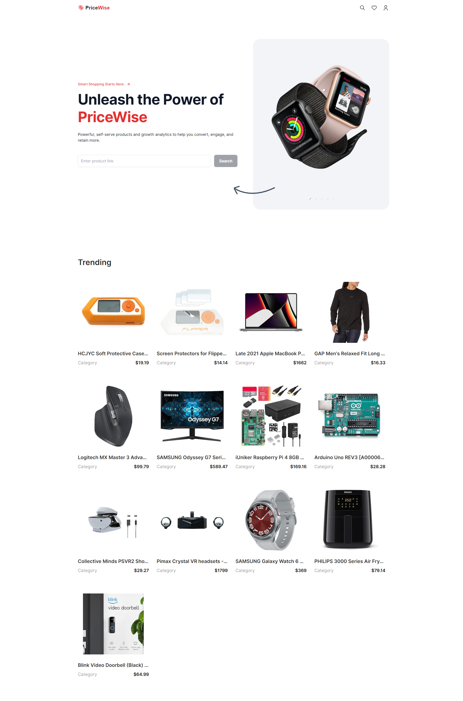
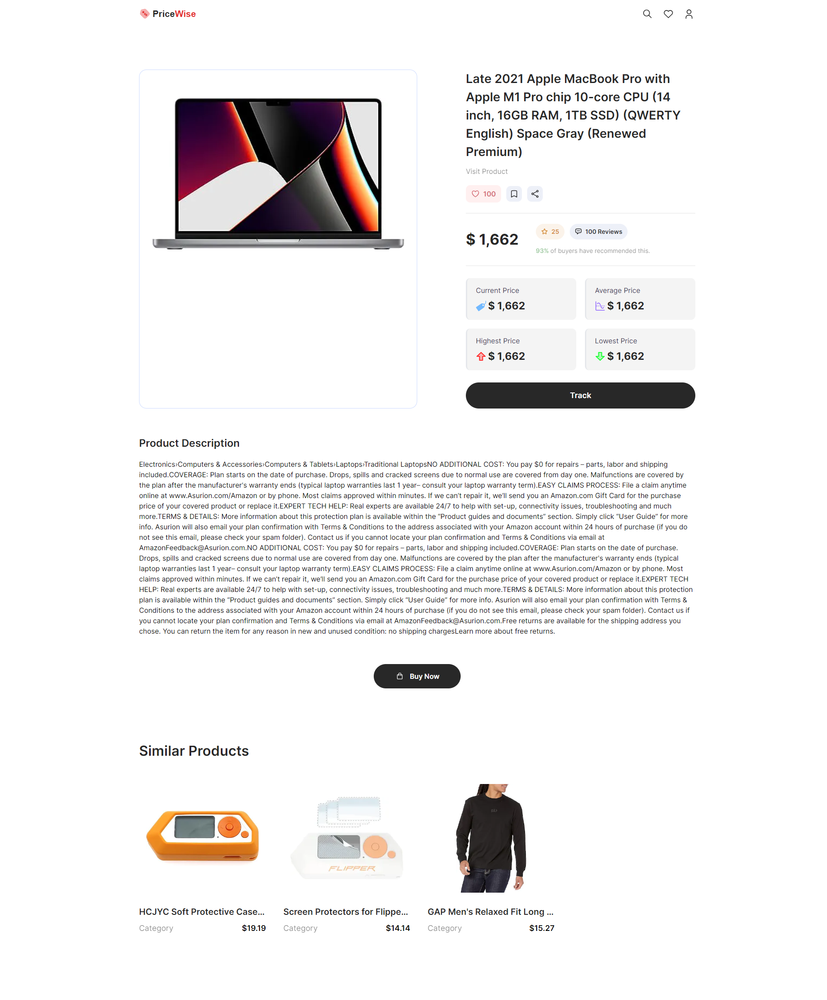

<a name="readme-top"></a>

<div align="center">


<br />
<br />

[](https://github.com/ladunjexa)
[](https://github.com/ladunjexa/nextjs13-pricewise/blob/main/LICENSE)
[](https://github.com/ladunjexa/nextjs13-pricewise/graphs/contributors)

[](https://github.com/ladunjexa/nextjs13-pricewise/network/members)
[](https://github.com/ladunjexa/nextjs13-pricewise/stargazers)
[](https://github.com/ladunjexa/nextjs13-pricewise/issues/)
[](https://github.com/ladunjexa/nextjs13-pricewise/issues/)

<h1 align="center">PriceWise</h1>
</div>

Dive into web scraping with a Next.js 13 eCommerce price tracker integrated with cheerio, cron jobs, sending emails, and more.

#### [View Demo](https://nextjs13-pricewise.vercel.app/)

## Table of Contents

- [Table of Contents](#table-of-contents)
- [:star2: Introduction](#star2-introduction)
  - [Folder Structure](#folder-structure)
    - [.vscode](#vscode)
    - [app](#app)
    - [components](#components)
    - [lib](#lib)
    - [public](#public)
    - [types](#types)
- [:space_invader: Technologies Used](#space_invader-technologies-used)
- [:toolbox: Getting Started](#toolbox-getting-started)
  - [:key: Prerequisites, Environment Variables](#key-prerequisites-environment-variables)
  - [:gear: Installation and Run Locally](#gear-installation-and-run-locally)
  - [Learn More](#learn-more)
  - [Deploy on Vercel](#deploy-on-vercel)
- [:camera: Screenshots](#camera-screenshots)
- [:wave: Contributing](#wave-contributing)
- [:warning: License](#warning-license)
- [:handshake: Contact](#handshake-contact)

## :star2: Introduction

_PriceWise_ application is a comprehensive solution for tracking product prices on Amazon. This project is designed to scrape product details from Amazon, store the data in a MongoDB database, and send email notifications to users when there are changes in the product details. The project includes a web application with a user-friendly interface that allows users to search for products, view product details, and subscribe to product updates. The application is built with Next.js and Tailwind CSS, and it includes several components such as a home page, product details page, navbar, search bar, product card, price info card, and modal.

The server-side logic is implemented with serverless functions that handle various tasks such as connecting to the database, scraping product details, updating product information, and sending email notifications. The project also includes several utility functions for extracting information from web pages and formatting numbers.

### Folder Structure

<b>PriceWise</b> code folder structure is as follows:

```
nextjs13-pricewise/
├── .vscode/
├   └── settings.json
├── app/
├   ├── api/
├   ├   └── cron/
├   ├   ├   └── route.ts
├   ├── products/
├   ├   └── page.tsx
├   ├── favicon.ico
├   ├── globals.css
├   ├── layout.tsx
├   └── page.tsx
├── components/
├   ├── HeroCarousel.tsx
├   ├── Modal.tsx
├   ├── Navbar.tsx
├   ├── PriceInfoCard.tsx
├   ├── ProductCard.tsx
├   └── Searchbar.tsx
├── lib/
├   ├── actions/
├   ├   └── index.ts
├   ├── models/
├   ├   └── Product.model.ts
├   ├── nodemailer/
├   ├   └── index.ts
├   ├── scraper/
├   ├   └── index.ts
├   └── mongoose.ts
├   └── utils.ts
├── public/
├   └── assets/
├   ├   ├── icons/
├   ├   ├   └── [[...]].svg
├   ├   └── images/
├   ├       └── [[...]].{png,svg}
├   ├── next.svg
├   └── vercel.svg
├── types/
├   └── index.d.ts
├── .eslintrc.json
├── next.config.js
├── package.json
├── postcss.config.js
├── tailwind.config.js
└── tsconfig.json
```

Now let's dive into the root folder and see what it contains.

#### .vscode

`settings.json`

This is a JSON file contains the settings used in Visual Studio Code.

#### app

`favicon.ico` - `globals.css` - `layout.tsx` - `page.tsx` - `api/` - `products/`

The app directory contains the application's favicon, the global styles, the layout component and the page component which is the home page of the application, the api directory which contains the serverless functions, and the products directory which contains the product details page.

#### components

`HeroCarousel.tsx` - `Modal.tsx` - `Navbar.tsx` - `PriceInfoCard.tsx` - `ProductCard.tsx` - `Searchbar.tsx`

The components directory contains all the components used in the application.

#### lib

`actions/` - `models/` - `nodemailer/` - `scraper/` - `mongoose.ts` - `utils.ts`

The lib directory contains all the server-side logic used in the application. The actions directory contains all the functions used in the serverless functions, the models directory contains the Product model, the nodemailer directory contains the functions used to send emails, the scraper directory contains the functions used to scrape product details, the mongoose.ts file contains the database connection, and the utils.ts file contains the utility functions.

#### public

`icons/` - `images/` - `next.svg` - `vercel.svg`

The public directory contains the media used in the application. The assets folder contains all the images and icons used in the application.

#### types

`index.d.ts`

This is a TypeScript code contains all the types used in the application.

<p align="right">(<a href="#readme-top">back to top</a>)</p>

## :space_invader: Technologies Used

PriceWise web application is built using the following technologies:

- [TypeScript](https://www.typescriptlang.org/): A statically typed superset of JavaScript. It is used for writing the code.
- [Next.js](https://nextjs.org/): A React framework for building web applications. It is used for both the frontend and the backend of the application.
- [Tailwind CSS](https://tailwindcss.com/): A utility-first CSS framework for rapidly building custom designs. It is used for styling the application.
- [Mongoose](https://mongoosejs.com/): An Object Data Modeling (ODM) library for MongoDB and Node.js. It is used for defining the product schema and interacting with the MongoDB database.
- [Nodemailer](https://nodemailer.com/about/): A module for Node.js applications to allow easy email sending. It is used for sending email notifications to users.
- [Axios](https://axios-http.com/): A promise-based HTTP client for the browser and Node.js. It is used for making HTTP requests to scrape product details from Amazon.
- [Cheerio](https://cheerio.js.org/): A fast, flexible, and lean implementation of core jQuery designed specifically for the server. It is used for parsing the HTML response from the Amazon product page.
- [React Responsive Carousel](https://www.npmjs.com/package/react-responsive-carousel): A lightweight carousel component for React. It is used for displaying a carousel of images on the home page.
- [Google Fonts](https://fonts.google.com/): A library of free licensed font families. It is used for defining the font styles in the application.
- [ESLint](https://eslint.org/): ESLint is a static code analysis tool for identifying problematic patterns found in JavaScript code.
- [Vercel](https://vercel.com/): Vercel is a cloud platform for frontend developers, providing the frameworks, workflows, and infrastructure to build a faster, more personalized Web.

[](https://skillicons.dev)

<p align="right">(<a href="#readme-top">back to top</a>)</p>

## :toolbox: Getting Started

<!-- Installation -->

### :key: Prerequisites, Environment Variables

In order to run the project, you need to create a MongoDB database and get the connection URI. You can follow the instructions [here](https://docs.mongodb.com/guides/server/drivers/) to create a MongoDB database and get the connection URI, or you can use a MongoDB service such as [MongoDB Atlas](https://www.mongodb.com/cloud/atlas). then, you need to add the connection URI to the `.env` file in the root of your project:

```bash
MONGODB_URI=your_mongodb_uri
```

Also, you need to create a [Bright Data](https://brightdata.com/) account and establish Web Unlocker proxy

> Automated website unlocking system that leverages the residential network and includes CAPTCHA solving, automatic retries, and fingerprint management.

then, you need to get the proxy username and password and add them to the `.env` file in the root of your project:

```bash
PROXY_USERNAME=your_proxy_username
PROXY_PASSWORD=your_proxy_password
```

### :gear: Installation and Run Locally

Follow these steps to install and run the project:

1. **Clone the repository**

   Open your terminal and run the following command to clone the repository:

   ```bash
   git clone https://github.com/ladunjexa/nextjs13-pricewise.git
   ```

2. **Navigate to the project directory**

   ```bash
   cd nextjs13-pricewise
   ```

3. **Install Node.js**

   The project requires Node.js to run. If you don't have it installed, you can download it from [here](https://nodejs.org/en/download/).

4. **Install the required packages**

   The project requires several packages to be installed. Run the following command to install them:

   ```bash
   npm i
   ```

5. **Start the server**

   Run the following command to start the server:

   ```bash
   npm run start
   ```

Now, you should be able to access the project at `http://localhost:3000`.

Please note that the project requires the "m.media-amazon.com" domain to be accessible for image handling. If you are unable to access this domain, you may encounter issues with image loading.

This is a [Next.js](https://nextjs.org/) project bootstrapped with [`create-next-app`](https://github.com/vercel/next.js/tree/canary/packages/create-next-app).

### Learn More

To learn more about Next.js, take a look at the following resources:

- [Next.js Documentation](https://nextjs.org/docs) - learn about Next.js features and API.
- [Learn Next.js](https://nextjs.org/learn) - an interactive Next.js tutorial.

You can check out [the Next.js GitHub repository](https://github.com/vercel/next.js/) - your feedback and contributions are welcome!

### Deploy on Vercel

The easiest way to deploy your Next.js app is to use the [Vercel Platform](https://vercel.com/new?utm_medium=default-template&filter=next.js&utm_source=create-next-app&utm_campaign=create-next-app-readme) from the creators of Next.js.

Check out our [Next.js deployment documentation](https://nextjs.org/docs/deployment) for more details.

<p align="right">(<a href="#readme-top">back to top</a>)</p>

## :camera: Screenshots




<p align="right">(<a href="#readme-top">back to top</a>)</p>

## :wave: Contributing

<a href="https://github.com/ladunjexa/Rainblur-Portfolio-Showcase/graphs/contributors">
  
</a>

Contributions are always welcome!

See [`contributing.md`](https://contributing.md/) for ways to get started.

Contributions are what make the open source community such an amazing place to learn, inspire, and create. Any contributions you make are **greatly appreciated**.

If you have a suggestion that would make this better, please fork the repo and create a pull request. You can also simply open an issue with the tag "enhancement".
Don't forget to give the project a star! Thanks again!

1. Fork the Project
2. Create your Feature Branch (`git checkout -b feature/AmazingFeature`)
3. Commit your Changes (`git commit -m 'Add some AmazingFeature'`)
4. Push to the Branch (`git push origin feature/AmazingFeature`)
5. Open a Pull Request

<p align="right">(<a href="#readme-top">back to top</a>)</p>

## :warning: License

_PriceWise_ web application is open source and distributed under the [MIT License](https://github.com/ladunjexa/nextjs13-pricewise/blob/main/LICENSE).

<p align="right">(<a href="#readme-top">back to top</a>)</p>

## :handshake: Contact

If you want to contact me, you can reach me at [@ladunjexa](https://t.me/ladunjexa).

<p align="right">(<a href="#readme-top">back to top</a>)</p>
